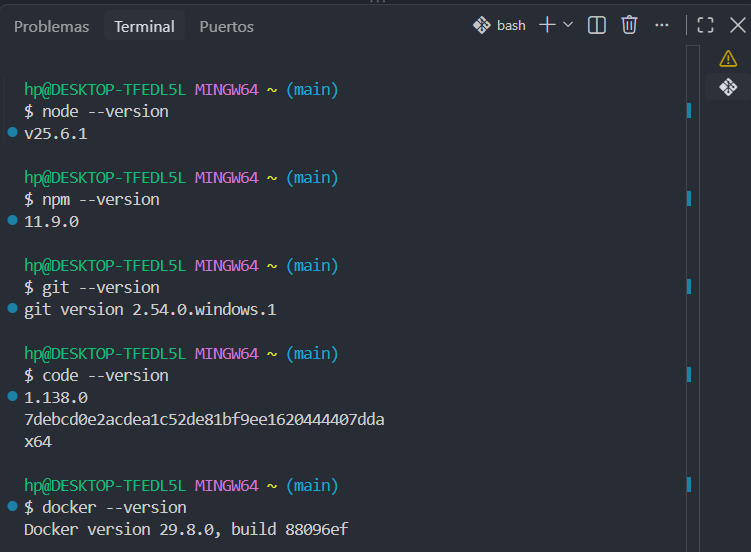
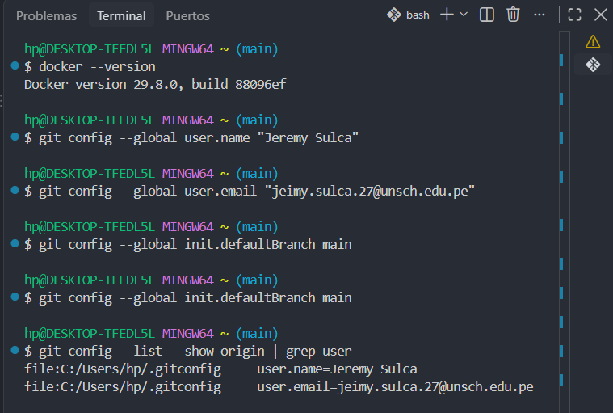

# Guía 01 – Arquitectura de Software

## Estudiante
Jeremy Sulca

## Descripción del curso
IS-488 Arquitectura de Software estudia cómo organizar y estructurar sistemas de software,
definiendo sus componentes principales, sus relaciones y las decisiones que permiten
que el sistema sea seguro, escalable y fácil de mantener.

## Expectativas del curso
- Aprender a diseñar la arquitectura de un sistema real.
- Trabajar en equipo usando Git y GitHub de forma profesional.
- Saber justificar las decisiones técnicas de un proyecto.

## Docente
Ing. Lizbeth Jaico Quispe

## Evidencias

### Paso 1: Verificación de versiones

### Paso 2: Configuración de identidad en Git

